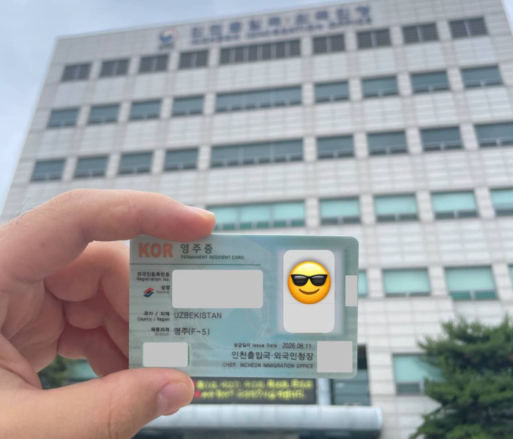

## Кириш сўзи

Кореяга илк бор 2017-йил бакалавр 4-курс «3+1 exchange program» учун келган эдим. Очиқ гап, биринчи келганимда бу давлат менга ёқмаганди. Ўзга миллат, ўзгача қадриятлар ва биз кира олмайдиган қатор ва қатор ошхоналар.
Дастур якунланиб, уйга қайтиб борганимда эса, Кореяга қайтиш тўғри қарор эканини секин аста англадим ва 2018 йил кузда D-2-3 виза билан магистратура ўқиш учун келдим. Шу кундан бошлаб 8 йил давомида неча бор иммиграция офисига қатнадим ва ниҳоят 8 йилдан сўнг доимий яшаш ҳуқуқини берувчи **F-5 визасига** эга бўлдим.
Ушбу мақолада ҳар бир визада юрган даврим, муаммолар, визани узайтириш ёки бир визадан бошқасига ўтиш даврида дуч келган муаммолар ва уларга қандай ечимлар топганим ҳақида батафсил ёздим. Умид қиламанки, бу тажрибам ўқувчига қизиқ бўлади ва ўз виза йўлини режалаштиришда манфаатли бўлади.

<!--more-->

## Виза йўлим қисқача

| Виза       | Муддат                       |
|:-----------|:-----------------------------|
| D-2-6      | 2017.06 - 2017.12            |
| D-2-3      | 2018.09 - 2020.08            |
| D-2-4      | 2020.09 - 2024.02            |
| E-7-1      | 2024.03 - 2025.10            |
| F-2-7      | 2025.11 - 2026.05            |
| **F-5-15** | **2026.06 - ҳозиргача**      |

## D-2 визадаги даврларим

Кореядаги чет элликларнинг жуда катта қисмини талабалар ташкил қилади. Шундай экан, бу виза тури деярли барчага таниш.
Буни бир вақтнинг ўзида энг хотиржам ва энг муаммоли виза деб айтиш мумкин.
- *Хотиржам*: сабаби, бу виза эгаси бўлсангиз, бирон университет талабасисиз ва ўқишингиз тамомланмагунча Корея давлатида яшаш ва визани узайтириш ҳуқуқларига эгасиз. Жиддий бўлмаган қоидабузарликлар кечирилади ёки жарима ва огоҳлантириш билан чекланади. Ундан ташқари, студент бўлганлик сабабидан сиздан кутиладиган натижалар ҳам юқори бўлмайди. Қайсидир маънода ўзингиз устингизда ишлаш учун энг кўп вақтга эга бўладиган виза тури шу.
- *Муаммоли*: бунга сабаб шахсий эҳтиёжлар ва имкониятлардан келиб чиқади. Агар сизда ўқишингиз учун етарли ресурслар билан таъминловчи _спонсор_ бўлса муаммо йўқ, лекин ҳаммасини ўз қўлингизга олсангиз, кўп ҳолларда қонун доирасидан чиқишга мажбур бўласиз ва муаммоларга дуч келасиз. D-2 виза эгалари учун ишлаш ва пул топиш имкониятлари чекланган. Бу эса ўз ўрнида кўплаб муаммоларга сабаб бўлади.

«Мен омадли талабалардан бири бўлганман», деб айта оламан. Йўналишим компьютер муҳандислиги бўлганлиги сабабли, магистратурага келишдан аввал профессор билан келишувга эришиб, ишлаш ва изланиш олиб бориш учун лабораторияга қўшилганман. Изланишларим натижалари шу лаборатория номидан чоп этилиши эвазига менга ойлик стипендия ажратилган. Тўғри, кўп эмас: мен PhD бўлиб оладиган 1 йиллик даромадимни бакалавр талабалари 2 ойлик «сезон» вақтида топиши мумкин эди. Лекин бошқа тарафдан, бу шартнома мени 5,5 йил давомида мунтазам ойлик билан таъминлади ва бор эътиборимни изланишлар қилишга, профессионал скилларимни кенгайтиришга ва нима мақсадда келган бўлсам, шу мақсаддан юришга имкон яратди. Ўқишни тамомлаб иш қидирганимда эса барчаси бекор кетмагани исботланди. Бу ҳақида батафсил пастда давом эттирамиз.

### Иммиграция рейди ҳақида

Кореядаги ҳаётим давомида кунлик ишларга чиқиш менда ҳеч қачон одат бўлмаган. Айниқса магистратура ва PhD даврларида доимо лабораторияда ишим бўлган ва ҳатто дам олиш кунлари ҳам ишлардим. Қисқа қилиб айтганда, қўшимча иш қилишга вақтим ҳам бўлмаган. Лекин «кўза кунда эмас, кунида синади» деб бекорга айтилмаган экан. Ана шу кўза айнан мен бирозгина қўшимча даромадни кўзлаган куним синди. Иммиграция рейдига тўғри келиб, 1 тунни «detention center»да ўтказдим ва 1,4 млн KRW жарима ва огоҳлантириш билан озод қилишди. Тўланган жарима ва у ерда ўтказилган вақт, ҳаммаси вақтлар ўтиб эсдан чиқиб кетди, лекин бу нарса менинг «профилим» учун катта минус бўлувчи ҳодиса бўлди. Ўша вақтлар, агар ўқишни тамомлаб ишга кира олмасам, ватанга қайтиб кетишим аниқ эди. Сабаби, D-10-1 поинт системаси учун баллим етмаслиги ойдинлашиб қолганди.

## Иш қидириш жараёни

2023 йил кузги семестр давомида PhD ни тамомлаш учун профессоримдан «рухсат» олдим. Барча талабларни бажариб, битирувим аниқ бўлганидан кейин асосий фокусни резюме тайёрлашга ва иш қидиришга қаратдим.
Иш қидириш учун фойдаланган платформалар:
- [LinkedIn](https://www.linkedin.com/) => job offer
- [Saramin](https://www.saramin.co.kr/) => 3 интервью
- [Wanted](https://www.wanted.co.kr/)   => 1 интервью

Кореядаги иш эълонлари платформаларида ўзингиз ҳақингизда маълумотларни тўлиқ киритишингиз сўралади ва CV платформанинг ўзида генерация қилинади. Кўплаб иш берувчилар ҳам айнан шу платформа яратган CV га ишонч билдиради. Шу сабабли ҳам вақтингизни аямасдан, имкон қадар тўлиқ CV тайёрлаш тавсия қилинади.
Резюме/CV ни қандай тайёрладим:
- Сайтдан сўралган ҳамма саволларга тўлиқ жавоб бердим
- Ўқишни энди тамомлаганим учун компания иш тажрибаси деярли йўқ эди, шу сабаб проектларимни тўлиқ ёритдим
- Портфолио: ўқиш вақтида ёки шахсий қизиқишлар билан қилган проектларимни битта PPT форматда демо видеолар билан тайёрладим
- Self-Introduction: ўзимни таништириб, қисқа видео тайёрладим. Бу менинг кандидатурам қатор рўйхат орасида ажралиб туриши учун эди

Тайёргарлик учун 2 ҳафтадан кўпроқ вақт сарфладим. Янги ҳафта душанба кунидан компанияларга CV жўнатишни бошладим ва LinkedIn да «Open To Work» бейджини ёқдим. Иш қидириш жараёни таймлайн кўринишида қуйидагича. Компания номлари A, B ҳарфлари билан қисқартирилган.
| Сана       | Компания     | Изоҳ                                                    |
|:-----------|:-------------|:--------------------------------------------------------|
| 2024.01.15 | 10 дан ортиқ | Saramin платформаси орқали резюме жўнатишни бошладим |
| 2024.01.16 | A            | Биринчи интервью таклифи жуда тез келди |
| 2024.01.16 | B            | Бир вақтнинг ўзида LinkedIn орқали HR менга алоқага чиқди ва менга мос иш ўрни борлигини айтди |
| 2024.01.17 | A            | Интервьюга бордим, корейс тилида амаллаб суҳбатлашдим. Суҳбат қилувчи инглиз тилида «hello» ни ҳам билмас экан |
| 2024.01.17 | C, D         | Шу куннинг ўзида яна иккита компаниядан интервьюга таклиф олдим |
| 2024.01.17 | A            | Кечга яқин иккинчи интервью учун таклиф олдим. Бу сафар LG даги ҳамкорлар суҳбат қилишини айтди |
| 2024.01.18 | B            | LinkedIn дан қилинган таклиф бўйича биринчи интервью. Жуда ижобий руҳда ўтди |
| 2024.01.18 | B            | Интервьюдан кейин HR дан қўнғироқ бўлди ва иккинчи интервью CEO билан бўлишини айтди |
| 2024.01.19 | A            | Биринчи компания билан иккинчи интервью Zoom орқали бўлди. Бу сафар ҳам инглизчада гапира олмадим |
|     ~      | ~            | Дам олиш кунлари |
| 2024.01.22 | A            | Иккита интервьюдан сўнг *корейс тили билмаганим учун* отказ олдим |
| 2024.01.23 | B            | Интервью бу сафар CEO билан бўлди ва асосан компания келажаги ва биргаликда нималар қила олишимиз ҳақида суҳбатлашдик |
| 2024.01.23 | B            | CEO билан суҳбатдан кейин компаниядан кетмасдан туриб *job offer* олдим ва ўз ўрнида қабул қилдим |
| 2024.01.23 | C, D         | Аллақачон *job offer* олганим учун бу ҳафта режалаштирилган интервьюларни бекор қилдим |
| 2024.01.25 | C            | Интервьюни бекор қилганимдан хафа эканликлари, лекин CEO мен билан учрашмоқчи эканини айтиб, кофешопда кўришишга таклиф олдим |
| 2024.01.29 | C            | CEO билан учрашдик. Улар мени ҳали ҳам ишга олишни хоҳлашлари ва ваъдалашган жойимдан кўпроқ ойлик бера олишларини айтди. Мен эса, лафз қилганим учун энди кета олмаслигимни айтиб узр сўрадим. Бу компанияда ишламаган бўлсам ҳам, улар томонидан менга берилган ишонч учун хурсанд бўлдим |
| 2024.02.16 | B            | Дипломимни олдим ва компания ҳужжатлари билан E-7 виза учун ариза топширдим |
| 2024.03.06 | B            | E-7 виза аризам тасдиқланди |
| 2024.03.07 | B            | Компанияда *Senior Engineer* лавозимида ишни бошладим |

Шундай қилиб, иш кунига ҳисобласак, ҳужжат топширганимдан бошлаб 6 кун ичида ишга жойлашдим. Қизиқ тарафи шундаки, мен ишга жойлашган компанияга ҳеч қачон ҳужжат топширмаган эдим. Компания ҳеч қачон мен тайёрлаган портфолио ва видеоларни кўрмаган эди. Бу шунчаки LinkedIn алгоритмига кўра профилим HR ойнасида кўриниб қолгани ҳисобига бўлди. Лекин тайёргарликларим бекор кетди дейиш ҳам хато. Суҳбат вақтида ўзим ҳақимда савол берилганда портфолио презент қилиб беришимни айтган эдим ва бундан кейин мен ва тажрибам ҳақида ортиқча саволлар ҳам бўлмаган эди. Қисқа қилиб айтганда, интервью савол-жавоб эмас, балки презентер-листенер кўринишида бўлган эди ва қайсидир маънода бу компанияга маъқул келган.

Янги ишни бошлаган вақтларим кўп ўйлардим: балки C компания таклифини қабул қилиб, кўпроқ ойлик олганим яхши бўлармиди деб. Лекин орадан йиллар ўтиб, мен ўшанда тўғри қарор қилганимни тушундим. Бунга иккита сабаб:
1. Кўпроқ ойлик таклиф қилган компания ҳақида маълумотларни 1 йил ўтиб ҳеч қаердан топа олмадим. Вебсайт ҳам, янгиликлар ҳам йўқ эди. Хулосам бўйича у компания кўп ўтмасдан ёпилган
2. Бир компанияда ҳозиргача 2 ярим йилдан узоқроқ ишлаб келмоқдаман, ва бу муддат ичида E-7, F-2 ва кейинроқ F-5 визаларни олишга эришдим, компания эса доим ҳар қанақа масалада қўллаб-қувватлаб келди.

Яна бир эътиборли тарафи: менда компанияда ишлаш тажрибам бўлмаса ҳам *Senior* левелда ишга қабул қилиндим. Бунга сабаб эса PhD давридаги эришилган ютуқлар ва қатнашган лойиҳалар бўлган. Шундай экан, агар сиз магистратурани тамомлаган бўлсангиз ва PhD қилиш ёки қилмаслик ҳақида ўйланаётган бўлсангиз, мен албатта PhD ҳам ўқишни маслаҳат бераман. Сабаби, сиз бунда 3-4 йил ютқазмайсиз, балки шу муддат тажриба сифатида ёзилади. PhD олганингиздан сўнг эса сиз энди 0 дан бошламайсиз.

## F-2-7

Одатда F-2 визага ўтиш жудаям катта «milestone», яъни марра ҳисобланади. Сабаби бу виза:
- компания ёки ўқишга бўлган боғлиқликдан сизни озод қилади
- ўз номингизда бизнес очиш ҳуқуқини беради
- оила аъзоларингизни осонроқ таклиф қила оласиз
- ва кўплаб устунликлар...
Қисқа қилиб айтганда, бу виза ўз номи билан «point-based residence», яъни, токи сиз етарли балл тўплай олар экансиз, сиз Кореяда резидент ҳисобланасиз.

Менинг тажрибамда эса бу ҳеч қачон орзу ёки марра бўлмаган: F-2 виза мен учун E-7 билан бир хил даражада ҳисобланган. Нега? Сабаби оддий: F-2 билан айнан бир компанияда ишлашга мажбурият йўқ, лекин поинт система бўйича етарли балл йиғиш учун барибир қаердадир ишлаётган бўлишингиз керак. Бу дегани, агар F-2 олдим деб хотиржам бўлсангиз, виза муддатини узайтириш вақти келганда афсус қиласиз. Демак, мен учун компанияга бириктирилган E-7 билан компаниядан мустақил F-2 ўртасида фарқ йўқ. F-2 олганимнинг сабаби эса шунчаки баллим етарли эди, ва қонунан ҳозирги визамдан анча юқорида туради. Шундай экан, нега олмаслигим керак?

### Кутилмаган муаммо ва кутилмаган ечим

Шахсий ҳисобим бўйича умумий баллим 95 эди. F-2-7 учун минимум 80 балл керак. Хотиржам эдим, лекин ҳар эҳтимолга қарши ёнимда E-7 визамни узайтириш учун ҳам қўшимча ариза тўлдириб олгандим. Агар F-2 га қабул қилинмай қолса, шу бир хил ҳужжатларни E-7 муддатини янгилаш учун топширишга тайёр эдим.

Мана шу кутилмаган вазият содир бўлди. Мен ўзим ҳисоблаб борган поинт қоғозини кўздан кечириб, ходим бирин-кетин ҳамма балларни қайта ҳисоблади ва охирида -20 балл ёзиб қўйди...
Бирдан хаёлимга келди: ахир менда 1,4 млн жарима бор эди. Демак, менда ҳозирги балл 75 ва бу F-2 учун етарли эмас. Мен E-7 учун ҳужжатни тайёрлашни бошладим. Ходим эса ҳали тугатмаган эди.
Яна бир-иккита ҳужжатларни кўздан кечириб, яна балларга қайтди ва +15 ёзди. Бунга мен ҳайрон бўлдим.

++Кейинроқ тушундим++, бунга сабаб яқиндагина янгиланган «top 1%» университетлар рўйхатига мен тамомлаган университет ҳам қўшилиб қолгани экан. Шунда мен Кореядаги топ 1% университетлардан бирини тамомлаганман ва буни учун +15 балл оламан.

Шундай қилиб, умумий балл 90 бўлди ва менга F-2 виза 2 йил муддатга берилди. Лекин 2 йилга етиб бормади, ҳали 1 йил ҳам охирига етмасдан F-5 визага алмаштиришга эришдим.

## F-5-15

F5 виза учун 30 га яқин турлар мавжуд ва ҳар бири учун талаблар ҳар хил. F-2-7 дан фарқли, F5 виза турлари балл системасига амал қилмайди, балки сиз танлаган бир тур учун сиз мос келасизми ёки йўқми шуни баҳолайди. Ўз ўрнида текширув муддати ҳам виза турига қараб ҳар хил. Кимдадир 1 ойдан кам бўлса, кимдадир 1 йилга яқин бўлиши мумкин. Ҳозир биз F-5-15 виза тури ҳақида гаплашамиз ва бу талаблар фақатгина шу виза турига тегишли.

***F-5-15*** : Корея университетидан PhD даражаси олганлар учун резидентлик визаси.
Бу виза тури бошқа турларига қараганда, PhD ҳурматидан бир қанча енгилликларга эга. Жумладан:
- йиллик даромад талаби GNIx2 дан GNIx1 гача туширилган. Агар сизда KIIP даражангиз бўлса, буни яна 70% гача камайтириш мумкин, лекин менда корейс тили даражам йўқ.
- корейс тилини билишлик мажбурияти олиб ташланган
- минимум иш билан таъминланганлик ҳақидаги талаблар олиб ташланган
- ва бошқалар

Тайёргарликни анча олдин бошладим. Сабаби, GNI талабини бажариш учун охирги якунланган йил учун солиқдан ҳисобот топшириш талаб қилинади. Бунда *охирги якунланган йил* тушунчаси жудаям муҳим, ва сиз қайси санада ҳужжат топширишингизга қараб фарқ қилади. Умумий қоидалар:
- ҳар йили март ойида ўтган календар йил учун расмий эълон қилинади ва 1-апрель санасидан бошлаб амал қилади
- бу дегани, ҳар йили март ойининг охирги санасигача ундан олдинги йил эълон қилинган GNI миқдори ҳисобга олинади
Тасаввур қилинг, 2024 йил учун GNI миқдори ~50 млн эди, 2025 йил учун эса 52,6 млн. Агар сиз 2026 йил 31-март санасида ҳужжат топширган бўлсангиз, ўтган йиллик даромадингиз 50 млн дан кўп эканини исботласангиз етарли, лекин агар сиз 1-апрель санасида ҳужжат топширсангиз, энди 52,6 млн дан кўпроқ эканини кўрсатиш керак бўлади.
Ўз ўрнида, сиз даромадингизни исботлаш учун солиқ идорасидан оладиган ҳужжат одатда май ойида тайёр бўлади. Яъни агар сиз 2026 йил 31-март санасида ҳужжат топшираётган бўлсангиз, сиз 2024 йил учун даромадларингизни исботлай оласиз холос. 2025 йил учун эса ҳали репорт тайёр эмас. Ҳар ҳолда компанияда ойлик олиб ишлайдиганларда шундай. Даромад исботлашнинг бошқа йўллари ҳам бор.

### GNI талабини қандай бажардим

Менинг вазиятимда 2024 йил учун даромадим етарли эмасди, сабаби ишни март ойидан бошлаганман, 2 ойлик кам бўлгани учун умумий миқдори GNI га етмас эди. Шу сабабли 2025 йилги репорт тайёр бўлишини кутишдан бошқа йўлим йўқ. Бунинг ёмон тарафи эса, ҳали 2026 март ойи келмасидан 2025 йил учун эълон қилинадиган GNI суммасини билмас эдим. Қўлимдан келадиган ягона иш, 2024 GNI миқдоридан сезиларли даражада кўпроқ даромад ҳисоблаш эди ва фақат шу йўл билан таваккал қилмасдан мақсадга эриша олардим.

Аслида йиллик даромадим контракт бўйича ҳозирги GNI миқдоридан юқори бўлса ҳам, таваккал қилмаслик учун куз фаслининг бошидаёқ ҳаракатни бошладим. Вазиятни иш жойимда масъул шахсларга тушунтирдим ва ёки ҳозирдан ойлигимни ошириб беришларини, ёки 2025 йил учун менга қўшимча бонус беришларини сўрадим. Улар буни жуда ижобий қабул қилди ва ёрдам беришга тайёр эканини, ҳозирда ойлик келишувлар вақти бўлмагани учун уларга бонус ҳисоблаб бериш варианти кўпроқ маъқул эканини айтдилар. Шундай қилиб, GNI масаласи жудаям осон ҳал бўлди.

### Ҳужжат топшириш ва текширув жараёни

Ҳужжатлар рўйхатини 1345 га телефон қилиб олдим. Узун рўйхатни ўзим тушунадиган кўринишга келтириб рақамлаб олдим ва тайёргарликни бошладим.
Анча узоқ вақт олди, лекин секин-асталик билан ҳаммасини тайёрладим. Қайта-қайта текширувдан кейин ниҳоят белгиланган кун келди ва ҳужжатларимни топширдим.

Ходим илиқлик билан, яхши кайфиятда кутиб олди. Ҳар ҳолда F-5 учун ҳар куни ҳам аризачи келавермайди.
Бироз камчиликлар бор экан (булар менга ташлаб берилган рўйхатда йўқ эди). Лекин булар учун аризам рад этилмади. Ҳужжатларим қабул қилинди ва қўшимча ҳужжатларни тезроқ топширишим айтилди. Мен ўша куннинг ўзида тайёрлаб, 2 соат ичида қайтиб келдим, ходим эса мени кўриб бирдан таниди ва қўшимча ҳужжатларимни ҳам қўшиб қўйди. Ҳар ҳолда мен атайлаб ишдан рухсат олганман, ҳар дақиқам қимматли. Ўзи компанияда ишлаган одам 1 соатни ҳам бекор кетказмасдан нимадир ҳужжат ишларини ҳал қилиб олишга уринадиган бўлиб қоларкан.

Хурсанд кайфиятда уйга келдим ва бирдан 1345 рақамидан смс келганини кўрдим. Унда D2 даврида тўлаган жаримам аниқлангани ва F-5 аризам қабул қилиниши учун махсус курсни (**준법시민교육**) тамомлашим кераклиги ёзилганди. Мен қайтадан 1345 га қўнғироқ қилдим, вазиятни тушунтириб, бу қандай курс, қандай қилиб регистрация қилиш ҳақида ҳамма саволларга жавоб олдим. Маълум бўлдики, бу иммиграция томонидан ташкил этилган атиги 3 соатлик семинар экан ва шунчаки қатнашсангиз имтиҳонсиз сертификат берилар экан. Имкон қадар яқинроқ санага жой банд қилдим, ва семинарга қатнашиб ўша куннинг ўзида топшириб келдим. Бу сафар мендан ҳужжатларни қабул қилган ходим эмас, бошқаси экан. Унга ҳам вазиятни тушунтириб топширдим ва қабул қилди. Орадан 1 ҳафта ўтмасидан, 15 июнь куни виза статусимни текшириб кўрган эдим, *F-5 (9999-99-99)* турган эди. Ва бу 11 июнь, яъни қўшимча ҳужжат топширганимнинг эртаси кунийоқ тасдиқланган экан.

Ариза топширган куни сўраганимда ходим аниқ қилиб *6 ойдан 1 йилгача оралиқда кўриб чиқилади* деган эди ва шуни учун ҳам камида кузги ойларга кутаётган эдим. Нега бунчалик тез қарор қилинди, аниқ сабабини билмайман, лекин тахминларим бор. Балким қўшимча ҳужжат топширганимда аризам қайта очилиб, қарор қилиниши тезлашиб кетгандир. Балким F-5-15 виза тури бўлгани учун, *бу йигит шундоқ ҳам PhD ни 5,5 йил кутган* деб ортиқ куттиришни хоҳлашмагандир. Балки шунчаки F-5 текшириш талаблари енгиллаштирилгандир ва аризалар тезроқ тасдиқланишни бошлагандир. Кейинроқ билишимча, 1 ой ичида F5 олганлар фақат мен эмас эканман, охирги пайтлар бундай *кейс*лар ҳам анча кўпайиб қолибди. Шундан келиб чиқадиган бўлсак, охирги тахминим ҳақиқатга яқинроқ.

### Топширилган ҳужжатлар

F-5 виза учун умумий ҳужжатлар
- 통합신청서(별지 34호)
- 여권
- 외국인등록증
- 수수료(20만원 + 등록증 3만5천원)
- 표준규격 사진 1매(3.5X4.5)
- 영주(F-5)자격 신청자 기본정보 (신청외국인 작성자료)
- 체류지 입증서류
- 신원보증서(별지 129호)
- 신원보증인 신분증 사본 -> 신원보증서 ёзиб берган шахснинг ID копияси
- 품행단정 요건 입증서류 : 해외범죄경력증명서 제출 면제 -> судланмаганлик ҳақида ҳужжат F-2-7 олганимда топширганим учун қайта сўралмайди
- 생계유지 요건 입증서류 : 소득주체별 제출
 - 납세증명서
 - 지방세 납세증명선
 - 체납증명서
 - 소득금액증명서

F-5-15 виза учун махсус ҳужжатлар
- 박사 학위증 사본 (학위증 원본 및 성적증명서) -> PhD диплом ва транскрипт
- 소속기업 사업자등록증 사본
- 재직증명서
- 4대 보험 사업장 가입자 명부
- 고용계약서 등 정규직 여부 확인 서류 등

## Маслаҳатлар

### Тил ўрганинг

Бу бироз ноодатий ўқилиши мумкин. Ахир мен ўзим корейс тилини ҳалигача билмайман. Лекин менинг ҳолатим махсус бир гуруҳга мос келади холос, умумий маслаҳат деб қабул қилиб бўлмайди. Ўзим ҳақимда айтсам, Кореяда 8 йилдан ортиқ яшаган бўлсам ҳам, ҳалигача тил ўрганишга кучли эҳтиёж сезмаганман. Доимо атрофимда менга инглиз тилида гапира оладиган инсонлар бўлган ва мендан сўраладиган талаблар бу гапириш эмас, балки ишимни тўғри бажариш бўлган. Бу менга тил ўрганиш борасида дангасалик қилишимга етарли сабаб бўлган ва талабалик давримдаги йилларимдан фойдаланиб тил ўрганмаганман. Айнан виза масаласида бу муаммо бўлмади, лекин ҳаёт тарзида доим эҳтиёж сезилади ва деярли ҳар куни бу менга панд беради. Токи Кореяда яшар экансиз, албатта тил ўрганинг. Одамлар билан ўз тилида гаплаша олиш уларнинг кўнглига йўл топиш учун биринчи қадам.

### Аниқ мақсад қўйинг

F5 ёки F2 бўладими, сиз албатта айнан қайси виза турини олишингиз кераклигини олдиндан билинг. Шунчаки *F5 олишим керак* деган мақсад етарли эмас. Сиз аниқ билишингиз керак, айнан қайси F-5 виза турини олмоқчи эканлигингизни. Шахсан менинг ҳолатимда, 2020 йил PhD ўқишни бошлаганимда барча F2 ва F5 виза турларини ўрганиб чиққанман ва бугунги эришганларимни ўша вақтдаёқ режа қилганман. Мен шунда ҳам ўз режамдан 1 йилга кеч қолдим. Агар янаям мукаммалроқ режа қила олганимда, янада эртароқ F5 олган бўлардим. Айтмоқчиманки, виза масаласи муддати тугашидан 1 ой олдин ўйланадиган масала эмас, буни узоқ муддат олдиндан режа қилсангиз мақсадга осонроқ эришасиз.

### Касбингизга фокус қилинг

Виза билан муаммо чиқмаслиги учун биринчи қадам, бу Кореяда керакли шахс эканлигингизни исботлай олишингиз. Қўполроқ бўлса ҳам мисол келтираман. Корея давлати ҳар доим ҳам завод ёки почта ишчиларини топа олади, буни учун айнан сиз бўлишингиз шарт эмас. Лекин сиз шунақа касбни мукаммал эгаллангки, сиз бўлмасангиз ўрнингиз билиниб қолсин. Ана шунда сизга бўлган талаб юқори бўлади ва ҳар қанақа ҳужжат бўйича муаммоларингизни ҳал қилиб берувчилар топилади. Айнан дастурчи ёки муҳандис бўлинг демайман. Таржимон бўлинг, ўқитувчи бўлинг, аналитик бўлинг, иқтисодчи бўлинг, доктор бўлинг, адвокат бўлинг, савдогар бўлинг, ким бўлсангиз ҳам ўз касбингизда энг яхшилардан бири бўлинг. Айнан мана шу ҳақиқий ютуқ. Барча визалар бонус сифатида келади.

## Охирги сўзлар

Авваламбор, мақолани ўқиб чиққанингиз учун раҳмат. Агар бундан сизга ёрдам бера оладиган бирон маълумот келтирилган бўлса, демак мақсадимизга етдик.
Агар сиз ҳам F-5 га етиш йўлида муаммоларга дуч келаётган бўлсангиз, асло таслим бўлманг! Секин-аста барчасига ечим топилади ва мақсадингизга етасиз. Мен Кореяга илк бор келганимда F-5 виза ҳақида ўқиб туриб, вақти келганда 2-3 йил вақтимни тил ўрганишга сарфлашим керак бўларкан деб ўйлаган эдим. Ёки бир вақтлар иммиграция *detention* марказида ўтирганимда F-5 олиш орзусидан воз кечган ҳам эдим. Лекин булар менга тўсиқ бўлмади, қайтанга жудаям енгиллик билан ҳал бўлди. Бу билан сиз ҳам PhD олинг деган фикрда эмасман. F5 учун 30 га яқин турлари мавжуд ва улар орасида сизга мос келадигани ҳам албатта топилади. Шунчаки бироз вақтингизни сарфлаб яхшилаб ўрганиб чиқинг ва шу мақсад томон ҳаракатдан тўхтаманг. Омад!
