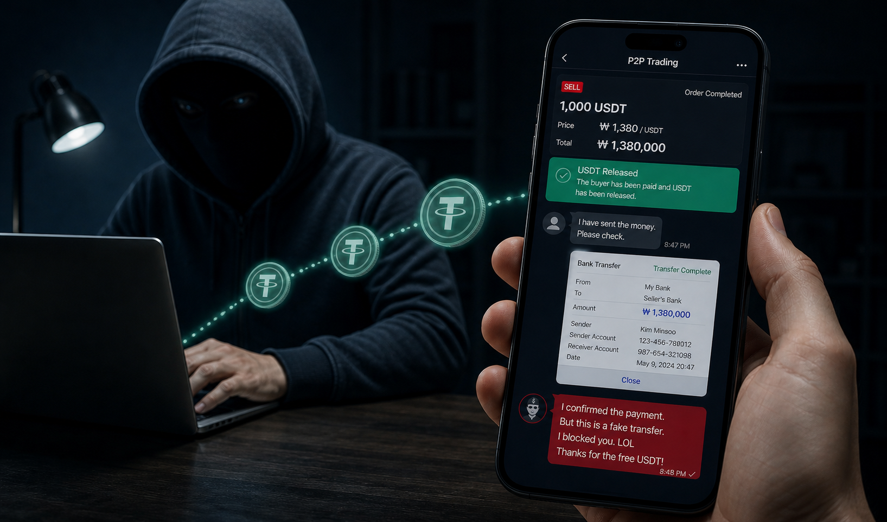
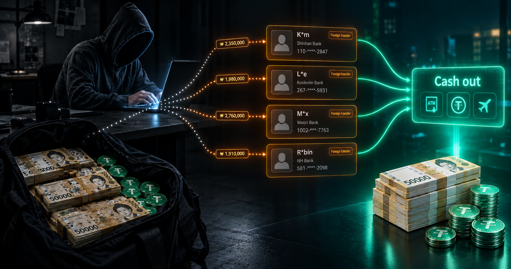
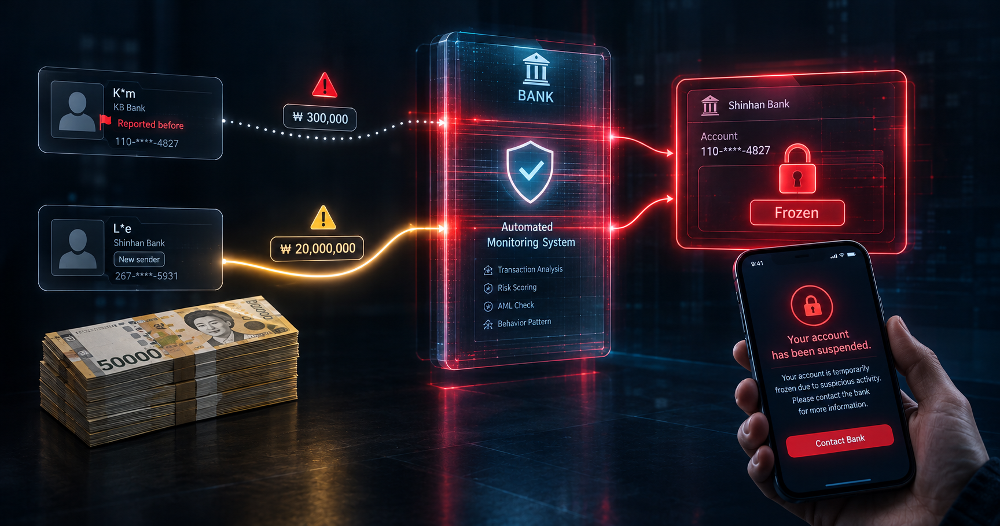
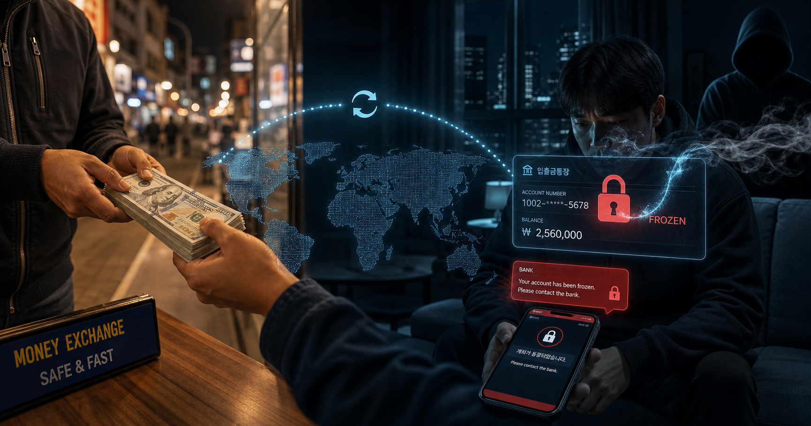

## Introduction

Picture this. You are quietly at home watching a film you like when suddenly an unknown number calls and says, "*This is the police calling. A complaint has been filed against you for **fraud***." And you have no idea what you did or when. Why did this happen?

Another example: you need a bank balance statement to renew your visa. Naturally you borrow money from an acquaintance for a short while. The money lands in your bank account, and a little later a message arrives from the bank to say *your account has been blocked*. Why did this happen?

An even simpler case: you decide to buy something through the 당근 app. The seller promises to post it to you and gives you a bank account for the transfer. You send the payment, but the item never comes. What can you do now?

Today we are going to talk about exactly these situations, where you get drawn into trouble without knowing it, and about how perfectly ordinary circumstances can pull you into the crime of "money laundering".

## What is "money laundering" anyway?

The short definition: it is the process of giving a lawful appearance to money or property obtained by illegal means, that is, concealing where it came from and moving it into the formal economy.

The money does not have to be "black" in the narrow sense, meaning the proceeds of terrorism, drugs, human trafficking or similar internationally prohibited activity. Simply circulating money that has "dodged tax" can be a form of money laundering too. For example, if you buy some goods in Korea and bring them into Uzbekistan without declaring them and sell them there, you are earning by avoiding state duties. That process in itself is not money laundering, but in the eyes of the law the income from those sales is treated as **proceeds of criminal activity**. Now, if you are sending that money back to Korea through channels where no tax is paid and using it to buy more goods, then you are engaged in a form of money laundering. Why? Because in Korea you are buying goods over and over again, which shows that your activity runs on the turnover of money that came from trade. But there is no legal basis showing that this income comes from trade: no state duty or taxes have been paid on the goods, and the activity is not on the state register. And even if you are not the one doing this yourself, if you are simply helping such a person move their money around, you count as an accomplice in money laundering. What is worth noting is that even if you do not know this person and have no idea whose money it is, being drawn into the process does not release you from liability.

So does that mean even a plain P2P currency swap counts as laundering? No, it does not. Say you have KRW in hand and an acquaintance in Uzbekistan has som. They give you som and you give them won. This can be regarded as an "*ordinary exchange of money*" and you are fully within your rights. But there is something to watch for. How well do you know that person, and how much do you trust the money they are handing you? If the money coming to you is "under watch" for some reason, you too can be deemed a participant in the process and brought in for questioning. Even then, if you can prove how the money reached you, it may not turn dangerous for you. By showing your conversations and your agreement with that person, for instance, you can prove the money is rightfully yours and keep it. So a little caution never hurts in financial dealings with someone you do not fully trust.

## Common situations

### Cryptocurrency trading

The most common situation, and the one treated directly as "money laundering", is dealing in cryptocurrency illegally. Trading USDT, USDC, BTC, ETH and all the other stable and non-stable coins is an example of this. Why? Because crypto assets are held on a blockchain platform independent of state control, and where it is unregulated there is no way to establish whose account a trade is being made from. So suspicious cases are treated as illegal right away. As an alternative, Korea has fully legalised crypto trading, and through state-registered, licensed national exchanges you can trade freely with no extra taxes or fees. But that option is restricted to people of Korean ethnicity and citizenship only. Foreigners have no way of trading crypto within the law. That is also why the number of foreigners accused of "money laundering" has risen sharply in recent years.

KuCoin. This exchange has been the reason a great many people had their bank accounts blocked or were held liable. Why? Simply because it offers a KRW-based P2P market. In Korea, P2P markets for crypto trading are illegal, and KuCoin runs the activity without a licence. So those who use it count as earning illegal income as well. ++It should be said here that the KuCoin exchange itself does not defraud its customers, it simply offers a platform to the people who do++.

Here is an example. You have 1000 USDT and you want to change it into KRW. In KuCoin's P2P section you will easily find people wanting to buy USDT, and the rate is far better than the bank's, which is of course the attraction. You create the trade and send your bank account details over chat. A little later the money arrives and you are even sent a receipt. Once you accept it, you transfer the USDT and the trade closes. At first glance it is all simple, straightforward and ideal. But everything actually begins after the money lands in your account, and one of the following three things can happen:
1. **A normal transaction**. Not everyone on P2P is a scam; there are honest traders just like you, and dealing with them causes no problem at all. The bank operation is simply accepted as normal, and nobody can trace the USDT trade.
2. **Your bank account gets blocked**. If the person who sent you the money is under watch, or if that money has been reported in connection with some fraud, the bank blocks your account without a second thought and demands proof of the transfer before unblocking it. That is, you have to submit a document proving that you received this money by a lawful or at least sensible route rather than through fraud, and that it belongs to you. Here you have two problems: *first*, to prove it you have to admit that you traded USDT on an illegal market; *second*, you do not even know for certain that the person who paid you is the same person you sold the USDT to.
3. **You get a call from the police**. Out of nowhere the police call and tell you, "you committed fraud against this person." You understand nothing, because you committed no fraud at all. You assume the person who received the USDT has filed a complaint against you. No, that is not it: the person who received the USDT cheated you and left, and you cannot find out who they are or where they are. The person who went to the police is a third party you know nothing about, someone caught up in the transaction, a poor soul who was cheated exactly like you.

==What actually happened?== At the moment you created your trade to sell USDT, the "*scammer*" buying from you on the P2P platform opened another trade at the same time on some other platform. They put up a listing to sell an item for an amount matching yours and gave the buyer the bank account they had taken from you. The third party transfers the money to you believing they are buying goods, you accept the money and send the USDT to the scammer in the middle. And just like that, they have 1000 USDT in hand without spending a single won of their own. Now they simply vanish, and nobody knows who they are or where they are. The person who thought they were buying goods has no choice but to report it to the police and show that they transferred money into your account. So the cheat cheated and got away, but the bill lands on your head. ++You may well ask++ how anyone can create another trade and find a buyer in such a short time. There are plenty of ways to do that too. For example, if you opened a trade for 1.3 million KRW, the scammer can advertise an item worth far more, a new iPhone say, at a cheap price. They can claim they need the money urgently, that they will let it go at that price only if payment comes right now, and that they will post the phone. Or they can keep listings like this permanently active and hold people ready to transfer money at any moment. One way or another, there are scammers who pull this off, and we are the ones who have to be careful.

---

If P2P is illegal and licensed exchanges are closed to foreigners, then how can USDT be changed into won? As the saying goes, those who search will find, and there are safe routes for this too.
1. *Use the exchanges in your own country*. Just like Korea, other countries offer their own citizens legalised ways to trade crypto on their territory. In Uzbekistan, for example, there are exchanges such as Binance and Asterium. The rate is lower and the fees are higher, but the important thing is that it is safe. To put it another way, "++paying tax is better than paying a fine++"
2. Trade P2P within your own circle of trust. Working through a close friend or a trusted intermediary can cut the risk down considerably. But that does not mean it is completely safe. Who the person you are trusting actually is still matters.

### Misuse of your personal data

"++Withdraw money from your bank account for me and I will give you 100,000 won a day++" --- who would not like an offer like that? The bank account is sitting idle anyway, and if you can earn 100,000 won a day just by taking cash out of an ATM, that comes to 3 million a month. Who could say no to an offer like that? But do not forget: it is a trap! However tempting the offer, walk away from it and keep yourself out of trouble.

Offers like this have already become quite widespread in job listing groups, and plenty of people have already managed to get deported behind them. So how do you get drawn into money laundering here? Very simply -- you are the one laundering the money, through your own account. Schemes of this kind can come at different levels:
1. **You are asked only for your account number and you take out the cash yourself**. This is the simplest form and it is usually done within a circle of trust. In most cases there is no problem either, because you are just doing an acquaintance a favour by turning their money into cash. But bear one thing in mind. If the money paid into you is being "laundered", your acquaintance will not be able to help you. Your account -- your problem.
2. **You are asked to hand over your bank card and your passwords**. This one is far more serious, and at this point your bank account is no longer under your control. The dangerous part is that if you do not know the person closely and you handed your passwords over to make money, then your future does not interest them and they can use the account as they please until it gets blocked. If something goes wrong, nobody will listen to you saying "I had lent out my bank card." Protecting your personal data is your own responsibility.
3. **You are asked to make international transfers in your own name**. Here the money circulates constantly: it usually comes into Korea as crypto, goes abroad from the bank account, is bought back as crypto and returns to Korea, and round it goes again and again. The process keeps running until it hits one of the problems discussed above. In short, the trail leads back to that same illegal crypto trade, and you are becoming its victim.

I am far from saying trust nobody in Korea. I only want to warn you to understand properly who you are placing your trust in and how much you are risking, and to decide after that. Nobody other than you has any right to know information connected with your bank account and your transfers, so if someone asks for it, let your first suspicion be that they are not to be trusted. Walking into trouble unknowingly does not release you from liability.

### Large bank transfers

Have you ever put together a one-day bank balance to renew a visa? Or lent money to a close acquaintance who was doing the same? Do you know how much you are actually risking in this simple, trouble-free-looking situation?

First of all, lending to an acquaintance or borrowing from one is a perfectly ordinary thing, and nobody is held at fault for it. But the matter of putting together a bank balance specifically runs a little deeper than ordinary lending and borrowing:
- *If you are the one borrowing*, pay attention to who you are asking for the money and where that money is coming from. An acquaintance promises to make up the bank balance for you, with just one condition -- you give it back in cash. Maybe it is safe, but it is suspicious. If they want it back in cash, the money is most likely being transferred not from their own account but from some third party's. If they want it paid into your account rather than their own and taken out as cash, something is going on here. It is simply better to be careful and stay well away from situations like this. There have been plenty of cases of people getting drawn into money laundering by taking money from a stranger to make up a bank balance. The reason is that people who need a one-day bank balance are "ideal prey" for launderers. You need money for one day; what they need is a "clean account". I hope you see the picture.
- *If you are the one lending*, be twice as careful. First of all, find out who else your acquaintance has borrowed from and how much they are gathering in total. You may not be handing over a large sum on your own, but you are contributing to a large sum being assembled. If a suspicious transaction is found among that money, the bank blocks that account completely, and your money may be left inside it with no way back. "I lent it to an acquaintance for a bank balance, his account got blocked and he cannot return it" is probably a situation familiar to many. So always keep your eyes open.

---

When it comes to putting together a bank balance, the risk is not actually in the money being "laundered". The money paid into you can be entirely clean and there are still cases where the bank blocks the account. Here the problem is not the money but the account! How so? Imagine you barely use your account in daily life. Even when you do, you spend very small amounts and keep very little money in it. For a whole year your account has held at most 200,000 won, and then suddenly 20 million won is paid in. It is natural for the bank to grow suspicious in a case like that, and it has the right to freeze the money until you prove you came by it properly. This situation is not serious in the way being suspected of money laundering is, because you are in contact with the person who sent the money and you can prove you borrowed it. All you need is to show what you needed such a large sum for.

### International P2P transfers

It is no secret to anyone that bringing money in from abroad through a bank is expensive. First, the rate is much worse, and second, there are the transfer fees. The most convenient option is of course a P2P transfer. Here your family members or an acquaintance abroad hand the money to an intermediary over there, and in Korea it is paid into your account in won. What is the risk here? The same situation as above in a slightly different form --- ++you cannot know who the money coming to you is from, or what kind of money it is, until it has already landed in your account++.

What can be done in a situation like that? If you have no choice but to go through P2P, take cash only. Or deal only with people you trust yourself. Simply do not let strangers pay strange money into your account.
